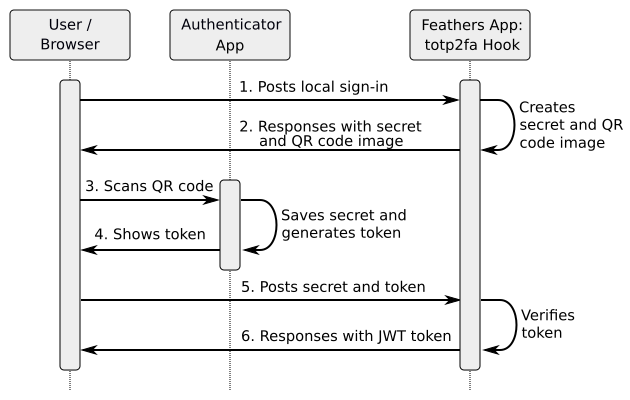
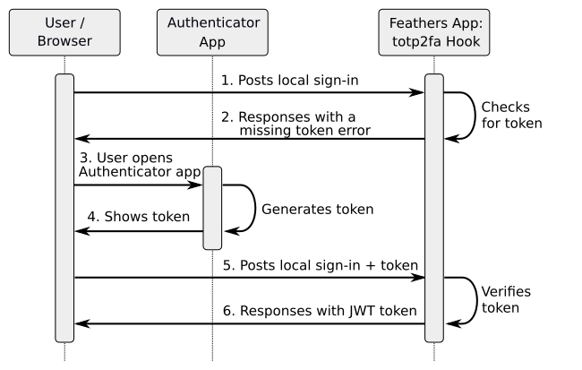

# Usage

To use this package, you should be familiar with the concept of TOTP two-factor authentication in general.

This package can easily be integrated and configured in a Feathers application with [Local Authentication](https://docs.feathersjs.com/api/authentication/local.html) strategy enabled. The TOTP 2FA is added as an additional step (hook) to the authentication service.

The setup requires the addition of a single hook to the authentication service, the extension of the user model and some additional implementations in the frontend ("login page"). All steps are described in detail in the following.

## Backend Implementation

Just add the `totp2fa` hook of this package to the _after_ hooks of the `create` method in the `authentication` service, e.g.:

```js
const {
  AuthenticationService,
  JWTStrategy,
} = require("@feathersjs/authentication");
const { LocalStrategy } = require("@feathersjs/authentication-local");
const { expressOauth } = require("@feathersjs/authentication-oauth");

const { totp2fa } = require("feathers-totp-2fa").hooks;

module.exports = (app) => {
  const authentication = new AuthenticationService(app);

  authentication.register("jwt", new JWTStrategy());
  authentication.register("local", new LocalStrategy());

  app.use("/authentication", authentication);
  app.configure(expressOauth());

  // TOTP 2FA Hook
  app.service("authentication").hooks({
    after: {
      create: [totp2fa()],
    },
  });
};
```

The `totp2fa` hook can be invoked with the following options:

- `usersService`: the name of the users service (default: `users`),

- `secretFieldName`: the name of the field in the user model to store the TOTP secret (default: `totp2faSecret`),

- `requiredFieldName`: the name of the field in the user model which indicate if 2FA is required for this user ( default: `totp2faRequired`),

- `applicationName`: the name of the application, which will be shown in the Authenticator app (default: `Feathers App`).

For example:

```js
 // TOTP 2FA Hook
app.service("authentication").hooks({
    after: {
      create: [totp2fa({
          usersService: "users",
          secretFieldName: "totp2faSecret",
          requiredFieldName: "totp2faRequired",
          applicationName: "My Feathers App"
      })],
    },
  });
};
```

The `users` model of your app has to be extended with the following fields:

- `totp2faSecret`(String): will contain the TOTP secret,

- `totp2faRequired`(Boolean): if true, the user has to use TOTP 2FA to login. This field is optional. If not used, all users have to use TOTP 2FA.

(If you have changed the field names in the configuration of the hook, use your own field names here.)

## Frontend Implementation and Process Flow

There are two phases:

1. **Setup up phase:** The creation of a TOTP secret and its storage in the database and in an Athenticator app.

2. **Operation phase:** The validation of a TOTP token in the login process.

### Setup up phase

Initially, a TOTP secret has to be generated in the Feathers app, send to the frontend together with a QR code, where the user can scan the QR code with an Authenticator app on a smartphone/tablet. The necessary steps are shown in the following figure and are described below:



The setup phase starts with the frontend sending a normal sign-in request to the Feathers app (1). For example:

```json
{
  "strategy": "local",
  "email": "user@example.com",
  "password": "password"
}
```

Feathers will authenticate the user, i. e. generate a JWT and add it to the response object. After this, the `totp2fa` hook will be invoked and check if TOTP 2FA is required for this user and if so, it will check if a TOTP secret has already been stored in the user data. If there is already a secret, the hook will trigger a 403 error `Token required.`, and the frontend has to ask the user for this token (see next section). Otherwise, the `totp2fa` hook generates a TOTP secret and a QR code image containing the auth path with this secret and adds it to the response to the client/frontend (2):

```json
{
  "data": {
    "secret": "[TOTP secret]",
    "qr": "[QR code image, base64 encoded]"
  }
}
```

The next steps have to be implemented in the frontend: The frontend ("login page") analyses the response. If it contains the secret and QR code, the frontend shows the QR code to the user (the QR code is an base64 encoded image). This QR code can be scanned with the Authenticator app (3), which saves the secret and presents a token based on this secret to the user (4). The user types the token in an input field in the frontend, e.g. next to the normal login fields.

The frontend sends the secret together with the token back to the authentication service in the Feathers app (5). The request body contains also the normal authentication credentials:

```json
{
  "strategy": "local",
  "email": "user@example.com",
  "password": "password",
  "secret": "[TOTP secret]",
  "token": "[TOTP token]"
}
```

The `totp2fa` hook verifies the token and stores the secret in the user data. Finally, the backend responses with the normal JWT (6).

### Operation phase

In normal operation, the user will login and add the TOTP token, which is shown in the Authenticator app, in addition to the normal credentials.

The frontend may send the credentials together with the TOTP token to the Feathers authentication servce. Or it sends the normal credentials first, receives an `Token required` error and sends in a second step credentials together with the TOTP token. The latter approach may be used if 2FA is not required for all users. This process flow is described in the following:



The frontend sends a normal sign-in request to the Feathers app (1). For example:

```json
{
  "strategy": "local",
  "email": "user@example.com",
  "password": "password"
}
```

Feathers will authenticate the user, i. e. generate a JWT and add it to the response object. After this, the `totp2fa` hook checks if TOTP is required for this user, and if so, it will check if a TOTP secret has already been stored in the user data. If so, it will check if a valid token is part of the frontend request.

If the token is missing, the hook will trigger a `Token required` error (2). Otherwise the hook will continue with the final step (6).

Now, the frontend should ask the user to enter a valid token from the Authenticator app (3). Therefore, the login form has to be extended with an input field for this token.

The user enters the token from the app, and the frontend sends the normal credentials together with the TOTP token to the Feathers authentication service (5):

```json
{
  "strategy": "local",
  "email": "user@example.com",
  "password": "password",
  "token": "[TOTP token]"
}
```

If the `totp2fa` hook verifies this token, the backend will respond with the normal JWT (6).
